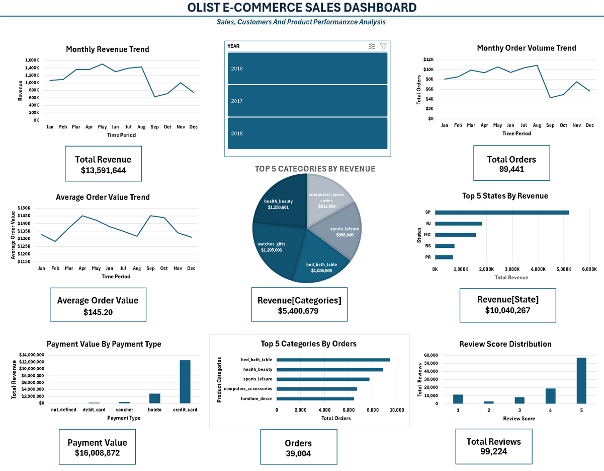
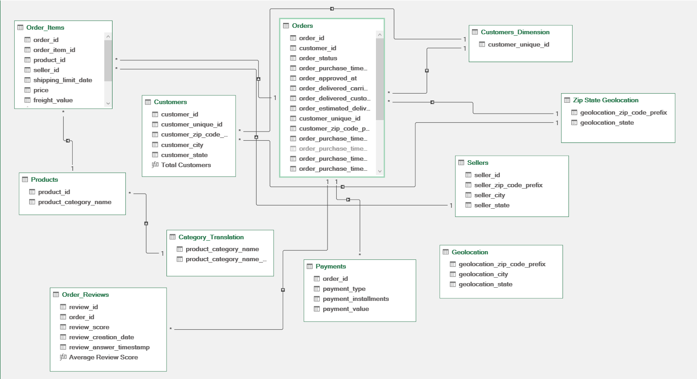

# 🛒 Olist E-Commerce Sales Analytics Dashboard

  <strong>Interactive E-Commerce Sales Analysis using Microsoft Excel</strong>

  

---

## 📌 Project Overview

An interactive **E-Commerce Sales Analytics Dashboard** built using **Microsoft Excel 365** to analyze sales, orders, customers, products, payments, reviews and geographic performance.

The project transforms multiple raw datasets into a structured **Excel Data Model** and presents the analysis through an interactive dashboard with KPIs, PivotCharts and a Year Slicer.

---

## 🎯 Business Objectives

- Track revenue and order performance over time.
- Identify high-performing product categories.
- Analyze geographic revenue distribution.
- Understand payment-method usage.
- Evaluate customer review performance.
- Compare order volume and revenue across categories.
- Monitor key operational and customer KPIs.

---

## 🧰 Tools & Technologies

**Excel 365 • Power Query • Power Pivot • Data Model • DAX • PivotTables • PivotCharts • Slicers**

---

## 🔄 Project Workflow

**Raw Data → Data Cleaning → Data Modeling → Calculations → Analysis → Dashboard → Insights**

### 1. Data Preparation
- Cleaned and validated multiple related datasets.
- Checked duplicates and missing values.
- Standardized geographic data.
- Investigated data-quality issues such as missing delivery dates and duplicate ZIP-code records.

### 2. Data Modeling
- Built an Excel Data Model.
- Created and validated table relationships.
- Used one-to-many relationships between related tables.
- Connected customers, orders, products, payments, reviews and geographic information.

### 3. Analysis & Dashboard
Created **8 KPIs** and **8 interactive visualizations** using PivotTables, PivotCharts and a Year Slicer.

---

## 📊 Dashboard KPIs

| KPI | Purpose |
|---|---|
| 💰 Total Revenue | Overall sales performance |
| 🛒 Total Orders | Order volume |
| 👥 Total Customers | Customer base |
| 💵 Average Order Value | Revenue per order |
| 🔄 Repeat Customer Rate | Customer retention |
| ⭐ Average Review Score | Customer satisfaction |
| 🚚 Delivered Order Rate | Fulfillment performance |
| ❌ Cancellation / Unavailable Rate | Order loss |

---

## 📈 Dashboard Visualizations

| Visualization | Purpose |
|---|---|
| 📈 Monthly Revenue | Revenue trend |
| 🛒 Monthly Orders | Order-volume trend |
| 💵 Monthly AOV | Average order value trend |
| 🥧 Top 5 Categories by Revenue | Revenue leaders |
| 📍 Top 5 States by Revenue | Geographic performance |
| 💳 Payment Analysis | Payment-method performance |
| ⭐ Review Score Analysis | Customer satisfaction |
| 🛍️ Top Categories by Orders | Order-volume leaders |

---

## 🔍 Key Business Insights

### 💰 Revenue
- **May** recorded the highest overall monthly revenue at approximately **$1.50M**.
- **September** recorded the lowest at approximately **$624.8K**.

### 🛍️ Categories
- **Health & Beauty** generated the highest revenue among the top five categories: **$1.26M**.
- **Bed, Bath & Table** led the displayed categories by order volume with **9,417 orders**.
- Revenue leaders and order-volume leaders are not always the same, highlighting the importance of analyzing both metrics.

### 📍 Geography
- **São Paulo (SP)** was the leading state by revenue with approximately **$5.20M**.

### 💳 Payments
- **Credit Card** dominated payment value at approximately **$12.54M**.

### ⭐ Reviews
- **5-star reviews** were the largest review group with **57,328 reviews**, indicating generally positive customer feedback.

---

## ⚙️ Technical Highlight — Dynamic KPIs

A key dashboard challenge was keeping KPI values dynamic when PivotTable structures changed after using the Year Slicer.

For example, the `Not Defined` payment category was absent in some years, causing the `Grand Total` row to move.

Instead of using a fixed cell reference, a dynamic lookup was used:

    =INDEX('Payment analysis'!B:B,MATCH("Grand Total",'Payment analysis'!A:A,0))

This allows the KPI to locate the current `Grand Total` row automatically.

**Result:** KPIs remain dynamic when the slicer changes the underlying PivotTable structure.

---

## 🎛️ Dashboard Interactivity

The dashboard uses a **Year Slicer** to dynamically update the analysis.

**Year Slicer → Data Model → PivotTables → KPIs & Charts**

The dashboard was also protected to prevent accidental modification while keeping the slicer interactive.

---

## 🖼️ Dashboard Preview

### Executive Overview

  

## 🗂️ Data Model

### A structured relational model connecting key e-commerce datasets for integrated analysis.

  

---

## 💡 Business Recommendations

- Investigate monthly revenue declines and seasonal patterns.
- Focus on high-revenue categories for promotions and product expansion.
- Analyze São Paulo as a benchmark market while identifying growth opportunities in other states.
- Maintain a reliable credit-card payment experience.
- Investigate low-rated reviews to identify product, delivery or service issues.
- Evaluate categories using **Revenue + Orders + AOV** rather than a single metric.

---

## 🧠 Skills Demonstrated

**Data Cleaning • Power Query • Data Modeling • Power Pivot • DAX • Excel Analytics • PivotTables • PivotCharts • KPI Development • Dashboard Design • Data Visualization • Business Insights**

---

## 📁 Repository Structure

Olist-Ecommerce-Sales-Analytics/

    ├── README.md
    ├── Ecommerce_Sales_Analytics.xlsx
    └── screenshots/
        ├── dashboard.png
        └── data-model.png

---

## 📊 Excel Dashboard

Download the complete interactive Excel workbook:

👉 [**Download Ecommerce Sales Analytics.xlsx**](./Ecommerce_Sales_Analytics.xlsx)

> **Note:** GitHub may not preview the workbook in the browser because of its file size. Download the file to open the interactive dashboard in Microsoft Excel.

---

## 👤 Author

### M.Saniya

**Aspiring Data Analyst**

> Turning raw e-commerce data into actionable business insights.